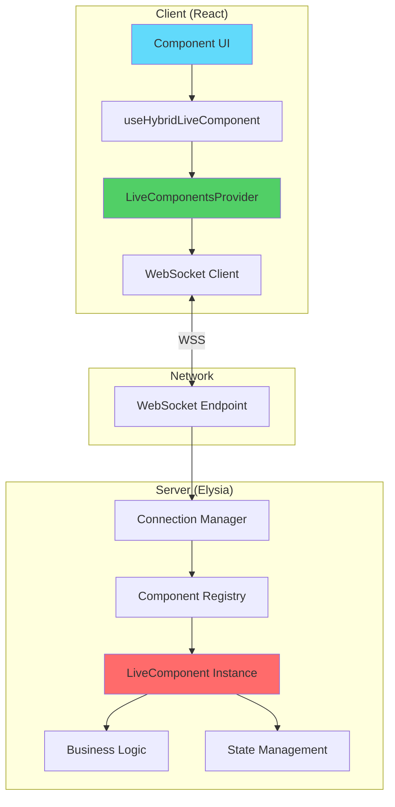
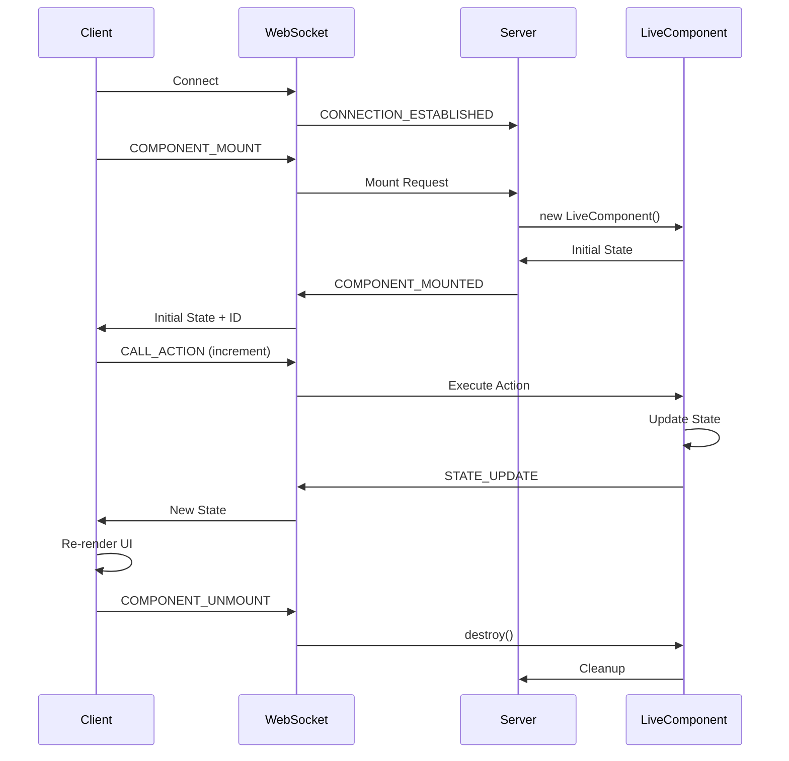

# 📊 Análise da Documentação de Live Components

> **Data**: 2025-01-18
> **Revisão de**: `ai-context/development/live-components.md` e `ai-context/reference/live-components-api.md`

---

## ✅ **PONTOS FORTES**

### 1. **API Reference Bem Estruturada** (`live-components-api.md`)
- ✅ Endpoints HTTP documentados com exemplos curl
- ✅ Tipos TypeScript completos para requests/responses
- ✅ Exemplos de código cliente/servidor funcionais
- ✅ Seção de troubleshooting com soluções práticas
- ✅ Coverage completo das mensagens WebSocket
- ✅ Exemplos de componentes completos (CounterComponent)

### 2. **Qualidade Técnica**
- ✅ Código está correto e alinhado com a implementação real
- ✅ Exemplos práticos que podem ser copiados diretamente
- ✅ TypeScript types ajudam developers a entender contratos

### 3. **Coverage Abrangente**
- ✅ Cobre HTTP endpoints, WebSocket, criação de componentes
- ✅ Inclui métricas de performance e monitoramento
- ✅ Documentação de connection pooling e escalabilidade

---

## ❌ **PROBLEMAS CRÍTICOS**

### 1. **Falta de Quick Start para Iniciantes**

**Problema**: Não há um guia "Hello World" de 5 minutos para developers começarem rapidamente.

**Impacto**: Desenvolvedores iniciantes ficam perdidos e não sabem por onde começar.

**Sugestão**:
```markdown
# Quick Start - Live Components em 5 Minutos

## 1. Criar um Live Component Simples

```typescript
// app/server/live/HelloComponent.ts
import { LiveComponent } from '@/core/types/types'

export class HelloComponent extends LiveComponent {
  state = { message: 'Hello, World!' }

  async updateMessage(newMessage: string) {
    this.state.message = newMessage
    await this.emit('message-updated', { message: this.state.message })
  }
}
```

## 2. Usar no Frontend (React)

```typescript
import { useHybridLiveComponent } from '@/core/client/hooks/useHybridLiveComponent'

function HelloWorld() {
  const { state, call } = useHybridLiveComponent('HelloComponent', {
    message: 'Hello'
  })

  return (
    <div>
      <h1>{state.message}</h1>
      <button onClick={() => call('updateMessage', 'Olá!')}>
        Change to Portuguese
      </button>
    </div>
  )
}
```

## 3. Rodar e Testar

```bash
bun run dev  # Backend + Frontend
# Acesse http://localhost:5173
```

**Pronto!** Você criou seu primeiro Live Component. 🎉
```

---

### 2. **Hook `useHybridLiveComponent` Não Documentado**

**Problema**: O hook mais importante para developers frontend não tem documentação.

**Impacto**: Developers não sabem:
- Como usar o hook corretamente
- Quais são os parâmetros e opções
- Como funcionam features avançadas (rehydration, state persistence)
- Como tratar erros e estados de conexão

**Evidência**: Analisando o código real em `core/client/hooks/useHybridLiveComponent.ts`, o hook tem:
- State persistence automático com localStorage
- Rehydration após reconnection
- Support para `useControlledField` (não documentado)
- Status complexo: `'synced' | 'disconnected' | 'connecting' | 'reconnecting' | 'loading' | 'mounting' | 'error'`

**Sugestão**: Criar seção completa:

```markdown
# useHybridLiveComponent Hook - Guia Completo

## API

```typescript
const {
  state,           // Estado do componente (read-only)
  loading,         // Se está carregando
  error,           // Mensagem de erro (se houver)
  connected,       // Se WebSocket está conectado
  componentId,     // ID único do componente no servidor
  status,          // Status detalhado da conexão
  call,            // Chama action sem esperar resposta
  callAndWait,     // Chama action e espera resultado
  mount,           // Monta componente manualmente
  unmount,         // Desmonta componente manualmente
  useControlledField  // Helper para inputs controlados
} = useHybridLiveComponent<StateType>(
  'ComponentName',
  initialState,
  {
    autoMount: true,        // Monta automaticamente? (default: true)
    fallbackToLocal: true,  // Usa estado local se servidor falhar? (default: true)
    room: 'room-id',        // Sala para broadcast (opcional)
    userId: 'user-123',     // ID do usuário (opcional)
    debug: false            // Ativa logs de debug? (default: false)
  }
)
```

## Status da Conexão

| Status | Descrição |
|--------|-----------|
| `synced` | Conectado e sincronizado ✅ |
| `disconnected` | Desconectado ❌ |
| `connecting` | Conectando pela primeira vez 🔄 |
| `reconnecting` | Reconectando após desconexão 🔄 |
| `loading` | Carregando estado inicial ⏳ |
| `mounting` | Montando componente no servidor ⏳ |
| `error` | Erro durante operação ⚠️ |

## State Persistence e Rehydration

O hook automaticamente:
1. **Salva estado** no localStorage quando recebe updates do servidor
2. **Restaura estado** quando reconecta (se < 1 hora)
3. **Valida estado** usando assinatura criptográfica do servidor

```typescript
// Exemplo: Estado persiste entre refreshes da página
const { state, status } = useHybridLiveComponent('TodoList', { todos: [] })

// Se você recarregar a página em < 1 hora:
// - Hook tenta rehydration automática
// - Se sucesso: restaura estado completo
// - Se falha: monta componente novo
```

## useControlledField - Inputs Controlados

Helper para inputs que precisam de estado temporário antes de enviar ao servidor:

```typescript
const { state, useControlledField } = useHybridLiveComponent('UserProfile', {
  name: 'João',
  email: 'joao@example.com'
})

function ProfileForm() {
  const nameField = useControlledField('name', 'updateName')

  return (
    <div>
      <input
        value={nameField.value}
        onChange={(e) => nameField.setValue(e.target.value)}
        onBlur={() => nameField.commit()}  // Envia ao servidor
      />
      {nameField.isDirty && <span>*</span>}
    </div>
  )
}
```
```

---

### 3. **Documentação `development/live-components.md` Muito Técnica**

**Problema**: O arquivo `development/live-components.md` é muito focado em implementação interna.

**Impacto**:
- Iniciantes não conseguem entender o conceito
- Falta narrativa de "quando usar"
- Muito jargão técnico (`ComponentRegistry`, `StateSignature`, etc.)

**Comparação**:

**Atual (muito técnico):**
```markdown
## Fluxo de Componentes
1. **Registro**: classes em `app/server/live/*.ts` estendem `LiveComponent`
   (veja `core/types/types.ts`) e são descobertas automaticamente.
2. **Conexão WebSocket**: o cliente (React ou outra UI) abre `ws://localhost:3000/api/live/ws`.
3. **Mensagens**: `COMPONENT_MOUNT` → monta componente e devolve snapshot inicial...
```

**Deveria ser (mais acessível):**
```markdown
## O Que São Live Components?

Live Components são componentes React que se comunicam em tempo real com o servidor via WebSocket.

**Conceito**: Escreva lógica de negócio no backend, e a UI atualiza automaticamente.

**Inspiração**: Laravel Livewire, Phoenix LiveView

### Quando Usar?

✅ **Use Live Components para**:
- Dashboards em tempo real (preços, métricas)
- Chat e notificações
- Formulários com validação server-side
- Features colaborativas (editing simultâneo)
- Qualquer UI que precisa refletir mudanças server-side imediatamente

❌ **NÃO use Live Components para**:
- Páginas estáticas
- Lógica puramente client-side (animações, UI local)
- APIs públicas (use REST/GraphQL)

### Como Funciona?

```
[React Component] ←WebSocket→ [Live Component (Server)]
      ↓                              ↓
  UI Updates  ←────────────  State Management + Business Logic
```

1. Component monta no servidor com estado inicial
2. Cliente recebe estado e renderiza UI
3. Usuário interage → Client envia action
4. Servidor processa action → Atualiza estado
5. Estado novo é enviado ao cliente automaticamente
6. UI re-renderiza com novo estado
```

---

### 4. **Falta Exemplo Real Documentado**

**Problema**: `LiveClockComponent.ts` é um exemplo real excelente no código, mas não está na documentação.

**Impacto**: Developers não veem exemplos de código real, apenas exemplos didáticos.

**Sugestão**: Adicionar seção "Exemplos Reais":

```markdown
# Exemplos Reais

## 1. Live Clock - Relógio em Tempo Real

Ver código completo: `app/server/live/LiveClockComponent.ts`

### Features Implementadas

- ✅ Atualização automática a cada segundo
- ✅ Broadcast para todos clientes conectados
- ✅ Formato 12h/24h
- ✅ Toggle de segundos e data
- ✅ Múltiplos timezones
- ✅ Uptime do servidor
- ✅ Cleanup automático de intervals

### Destaques de Implementação

**1. Interval Management**
```typescript
export class LiveClockComponent extends LiveComponent<LiveClockState> {
  private clockInterval: NodeJS.Timeout | null = null

  constructor(...) {
    super(...)
    this.startClock()  // Inicia interval
  }

  private startClock() {
    this.clockInterval = setInterval(() => {
      this.updateClock()
    }, 1000)
  }

  public destroy() {
    if (this.clockInterval) {
      clearInterval(this.clockInterval)  // ✅ CRÍTICO: limpar resources
    }
    super.destroy()
  }
}
```

**2. Broadcasting Updates**
```typescript
private updateClock() {
  this.setState({ currentTime: timeString })

  // Broadcast para TODOS clientes na mesma room
  if (this.room) {
    this.broadcast('CLOCK_TICK', {
      currentTime: timeString,
      timestamp: now.toISOString()
    })
  }
}
```

**3. Actions com Validação**
```typescript
async setTimeFormat(payload: { format: '12h' | '24h' }) {
  const { format } = payload

  // ✅ Validação server-side
  if (format !== '12h' && format !== '24h') {
    throw new Error('Invalid time format. Use "12h" or "24h"')
  }

  this.setState({ format })
  this.updateClock()  // Re-renderiza imediatamente

  return { success: true, format }
}
```

### Lições Aprendidas

1. **Sempre limpe resources**: `clearInterval`, `clearTimeout`, conexões DB
2. **Valide inputs**: Actions podem receber dados maliciosos
3. **Use broadcasting**: Para updates que afetam múltiplos clientes
4. **Return values**: Actions podem retornar dados para o cliente
```

---

### 5. **Falta Guia de Boas Práticas Avançadas**

**Problema**: Não há orientações sobre patterns avançados.

**Impacto**: Developers cometem erros comuns:
- Memory leaks (não limpam intervals)
- Security issues (não validam inputs)
- Performance problems (state updates excessivos)
- Error handling inadequado

**Sugestão**: Criar seção "Best Practices":

```markdown
# Live Components - Boas Práticas

## 1. Resource Management (CRÍTICO)

### ❌ ERRADO - Memory Leak
```typescript
export class BadComponent extends LiveComponent {
  constructor() {
    super()
    setInterval(() => {
      this.updateData()
    }, 1000)
    // ❌ Interval nunca é limpo
  }
}
```

### ✅ CORRETO
```typescript
export class GoodComponent extends LiveComponent {
  private interval: NodeJS.Timeout | null = null

  constructor() {
    super()
    this.interval = setInterval(() => {
      this.updateData()
    }, 1000)
  }

  public destroy() {
    if (this.interval) {
      clearInterval(this.interval)  // ✅ Cleanup
    }
    super.destroy()
  }
}
```

## 2. Security - Validação de Inputs

### ❌ ERRADO - Vulnerável
```typescript
async deleteUser(payload: { userId: string }) {
  // ❌ Sem validação - qualquer cliente pode deletar qualquer user
  await db.users.delete(payload.userId)
}
```

### ✅ CORRETO
```typescript
async deleteUser(payload: { userId: string }) {
  // ✅ Valida propriedade
  if (this.userId !== payload.userId) {
    throw new Error('Unauthorized: Cannot delete other users')
  }

  // ✅ Valida formato
  if (!payload.userId.match(/^[a-z0-9-]+$/)) {
    throw new Error('Invalid user ID format')
  }

  await db.users.delete(payload.userId)
}
```

## 3. Performance - Throttling de Updates

### ❌ ERRADO - Updates Excessivos
```typescript
async onMouseMove(payload: { x: number, y: number }) {
  // ❌ Envia WebSocket message em CADA movimento do mouse
  this.setState({ mouseX: payload.x, mouseY: payload.y })
  await this.emit('mouse-moved', payload)
}
```

### ✅ CORRETO - Throttled
```typescript
private lastEmit = 0
private EMIT_THROTTLE = 100 // 100ms

async onMouseMove(payload: { x: number, y: number }) {
  this.setState({ mouseX: payload.x, mouseY: payload.y })

  // ✅ Só emite a cada 100ms
  const now = Date.now()
  if (now - this.lastEmit > this.EMIT_THROTTLE) {
    await this.emit('mouse-moved', payload)
    this.lastEmit = now
  }
}
```

## 4. Error Handling

### ❌ ERRADO - Erro Mata Componente
```typescript
async fetchUserData(payload: { userId: string }) {
  const user = await api.getUser(payload.userId)  // ❌ Se falhar, quebra tudo
  this.setState({ user })
}
```

### ✅ CORRETO - Graceful Degradation
```typescript
async fetchUserData(payload: { userId: string }) {
  try {
    const user = await api.getUser(payload.userId)
    this.setState({ user, error: null, loading: false })
  } catch (error) {
    console.error('Failed to fetch user:', error)
    this.setState({
      error: 'Failed to load user data',
      loading: false
    })
    // ✅ Component continua funcionando
  }
}
```

## 5. State Design

### ❌ ERRADO - Estado Duplicado
```typescript
state = {
  users: [],
  userCount: 0,  // ❌ Derivado de users.length
  hasUsers: false // ❌ Derivado de users.length > 0
}
```

### ✅ CORRETO - Single Source of Truth
```typescript
state = {
  users: []  // ✅ Única fonte de verdade
}

// Cálculos derivados no getter ou no cliente
get userCount() {
  return this.state.users.length
}
```

## 6. Broadcasting - Use com Sabedoria

### ✅ QUANDO usar broadcast
- Updates globais (novo post no feed)
- Notificações para múltiplos users
- State compartilhado (collaborative editing)

### ❌ QUANDO NÃO usar broadcast
- State privado de um user
- Dados sensíveis
- Updates frequentes que não afetam outros users

```typescript
// ✅ BOM - Notificação global
async createPost(payload: { title: string, content: string }) {
  const post = await db.posts.create(payload)

  if (this.room) {
    this.broadcast('new-post', { post })  // Todos veem
  }
}

// ❌ RUIM - Broadcast de dado privado
async updatePassword(payload: { oldPass: string, newPass: string }) {
  await this.changePassword(payload)

  // ❌ NUNCA faça broadcast de senha!
  // this.broadcast('password-changed', payload)
}
```
```

---

### 6. **Fragmentação da Documentação**

**Problema**: Informação está dividida entre dois arquivos sem navegação clara.

**Impacto**: Developers não sabem qual arquivo ler primeiro.

**Estrutura Atual**:
```
ai-context/
├── development/live-components.md        (técnico, interno)
├── reference/live-components-api.md      (API reference)
```

**Sugestão**: Reorganizar com hierarquia clara:

```
ai-context/
├── development/
│   ├── live-components/
│   │   ├── 00-overview.md              (O que são? Quando usar?)
│   │   ├── 01-quick-start.md           (Hello World em 5min)
│   │   ├── 02-server-components.md     (Criar componentes server)
│   │   ├── 03-client-hooks.md          (useHybridLiveComponent)
│   │   ├── 04-advanced-patterns.md     (Patterns avançados)
│   │   └── 05-best-practices.md        (Security, performance)
│   └── live-components.md  → [DEPRECADO - redirecionar para 00-overview.md]
└── reference/
    └── live-components-api.md            (Continua como API reference)
```

---

### 7. **Falta Comparação com Alternativas**

**Problema**: Developers não sabem quando usar Live Components vs REST API vs GraphQL.

**Sugestão**:

```markdown
# Live Components vs Alternativas

## Quando Usar Cada Abordagem?

### 🔥 Live Components
**Use para**: Real-time updates, interactive UIs, dashboards

**Pros**:
- ✅ Updates automáticos sem polling
- ✅ State management no servidor
- ✅ Menos código boilerplate
- ✅ Type-safe com Eden Treaty

**Cons**:
- ❌ Requer WebSocket (pode ter problemas com proxies)
- ❌ Stateful (não escala horizontalmente sem sticky sessions)
- ❌ Não ideal para APIs públicas

**Exemplo**: Dashboard de vendas em tempo real

---

### 🌐 REST API (Eden Treaty)
**Use para**: CRUD tradicional, APIs públicas, operações stateless

**Pros**:
- ✅ Stateless - escala facilmente
- ✅ Caching HTTP padrão
- ✅ Compatível com qualquer cliente

**Cons**:
- ❌ Sem updates automáticos (precisa polling)
- ❌ Mais código boilerplate

**Exemplo**: API de cadastro de usuários

---

### 📊 GraphQL
**Use para**: Queries complexas, mobile apps, agregação de dados

**Pros**:
- ✅ Cliente escolhe dados necessários
- ✅ Reduz over-fetching

**Cons**:
- ❌ FluxStack não tem GraphQL built-in (use REST)

---

## Decision Matrix

| Feature | Live Components | REST API | GraphQL |
|---------|----------------|----------|---------|
| Real-time updates | ✅ Automático | ❌ Polling | ❌ Polling |
| Type Safety | ✅ Eden Treaty | ✅ Eden Treaty | ⚠️ Depende |
| Stateless | ❌ Stateful | ✅ Stateless | ✅ Stateless |
| Public APIs | ❌ Não ideal | ✅ Ideal | ✅ Ideal |
| Interactive UI | ✅ Ideal | ⚠️ OK | ⚠️ OK |
| Escalabilidade | ⚠️ Vertical | ✅ Horizontal | ✅ Horizontal |
| Caching | ❌ Difícil | ✅ HTTP Cache | ⚠️ Complexo |
```

---

### 8. **Falta Diagramas Visuais**

**Problema**: Documentação é 100% texto - faltam diagramas de arquitetura.

**Impacto**: Developers visuais têm dificuldade de entender fluxos.

**Sugestão**: Adicionar diagramas Mermaid:

```markdown
## Arquitetura de Live Components



## Fluxo de Mensagens


```

---

## 📋 **SUMÁRIO DE RECOMENDAÇÕES**

### 🔴 **CRÍTICO - Implementar ASAP**

1. **Quick Start de 5 Minutos**
   - Criar `ai-context/development/live-components/01-quick-start.md`
   - Exemplo "Hello World" copy-paste

2. **Documentar `useHybridLiveComponent`**
   - Criar `ai-context/development/live-components/03-client-hooks.md`
   - Incluir todas opções, helpers, e state lifecycle

3. **Best Practices e Security**
   - Criar `ai-context/development/live-components/05-best-practices.md`
   - Incluir resource management, validation, error handling

### 🟡 **IMPORTANTE - Próxima Iteração**

4. **Overview Acessível**
   - Reescrever `development/live-components.md` com foco em conceitos
   - Adicionar seção "Quando Usar vs REST API"

5. **Exemplos Reais Documentados**
   - Documentar `LiveClockComponent` como exemplo real
   - Adicionar mais exemplos práticos (Chat, Dashboard)

6. **Reorganizar Estrutura**
   - Criar subpasta `live-components/` com arquivos numerados
   - Adicionar README.md como índice navegável

### 🟢 **NICE TO HAVE - Futuro**

7. **Diagramas Visuais**
   - Adicionar diagramas Mermaid de arquitetura
   - Diagramas de fluxo de mensagens

8. **Comparação com Alternativas**
   - Decision matrix: Live Components vs REST vs GraphQL
   - Guia de quando usar cada abordagem

---

## 🎯 **CONCLUSÃO**

### Nota Geral: **6.5/10**

**Resumo**:
- ✅ API Reference está **excelente** (8/10)
- ⚠️ Development Guide está **muito técnico** (5/10)
- ❌ **Falta** Quick Start para iniciantes (0/10)
- ❌ **Falta** documentação do hook principal (0/10)
- ❌ **Falta** best practices e security (0/10)

**Recomendação**: A documentação está **funcional mas incompleta**. Developers experientes conseguem usar, mas iniciantes vão ter dificuldade. Implementar as sugestões **CRÍTICAS** vai melhorar drasticamente a DX (Developer Experience).

---

**Próximos Passos Sugeridos**:

1. Criar Quick Start primeiro (maior impacto)
2. Documentar `useHybridLiveComponent` (segundo maior impacto)
3. Best Practices (previne bugs e security issues)
4. Reorganizar estrutura (melhora navegação)
5. Adicionar diagramas (melhora compreensão)
