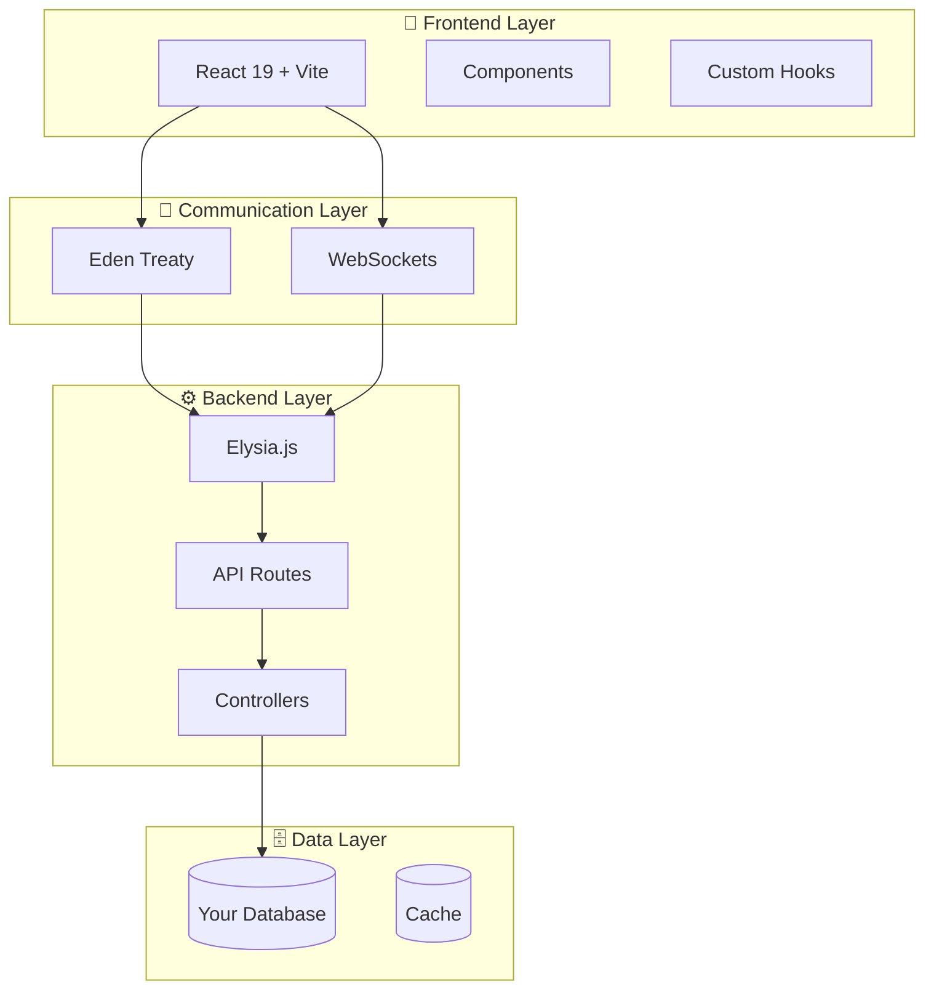

<div align="center">

# ⚡ FluxStack

### The Revolutionary Full-Stack TypeScript Framework

*Build modern web apps with Bun, Elysia, React, and Eden Treaty*

[](https://www.npmjs.com/package/create-fluxstack)
[](https://opensource.org/licenses/MIT)
[](https://bun.sh)
[](https://www.typescriptlang.org/)
[](https://reactjs.org/)

[Quick Start](#-quick-start) • [Features](#-key-features) • [Documentation](#-documentation--support) • [Examples](#-type-safe-api-development)

</div>

---

## ✨ Key Features

<table>
<tr>
<td width="50%">

### 🚀 **Blazing Fast**
- **Bun Runtime** - 3x faster than Node.js
- **Elysia.js** - High-performance backend
- **Vite 7** - Lightning-fast HMR

</td>
<td width="50%">

### 🔒 **Type-Safe Everything**
- **Eden Treaty** - Automatic type inference
- **End-to-End Types** - Backend to frontend
- **Zero Manual DTOs** - Types flow naturally

</td>
</tr>
<tr>
<td width="50%">

### 🛠️ **Zero Configuration**
- **One Command Setup** - `bunx create-fluxstack`
- **Hot Reload Built-in** - Backend + Frontend
- **Swagger Auto-Generated** - API docs out of the box

</td>
<td width="50%">

### 🎯 **Production Ready**
- **Docker Multi-Stage** - Optimized containers
- **Declarative Config** - Environment management
- **WebSocket Support** - Real-time features

</td>
</tr>
</table>

---

## 🚀 Quick Start

```bash
# Create a new FluxStack app
bunx create-fluxstack my-awesome-app
cd my-awesome-app
bun run dev
```

**That's it!** Your full-stack app is running at:

- 🌐 **Frontend & Backend**: http://localhost:3000
- 📚 **API Documentation**: http://localhost:3000/swagger
- ⚡ **Hot Reload**: Automatic on file changes

### Alternative Installation

```bash
# Create in current directory
mkdir my-app && cd my-app
bunx create-fluxstack .
bun run dev
```

---

## 💎 What You Get

<details open>
<summary><b>🎨 Modern Tech Stack (2025)</b></summary>

| Layer | Technology | Version | Why? |
|-------|-----------|---------|------|
| 🏃 **Runtime** | Bun | 1.2+ | 3x faster than Node.js |
| ⚙️ **Backend** | Elysia.js | 1.4.6 | Ultra-fast API framework |
| ⚛️ **Frontend** | React | 19.1 | Latest React features |
| ⚡ **Build Tool** | Vite | 7.1.7 | Instant dev server |
| 💅 **Styling** | Tailwind CSS | 4.1.13 | Utility-first CSS |
| 📘 **Language** | TypeScript | 5.8.3 | Full type safety |
| 🔌 **API Client** | Eden Treaty | 1.3.2 | Type-safe API calls |

</details>

<details open>
<summary><b>⚙️ Zero-Config Features</b></summary>

- ✅ **Automatic Type Inference** - Eden Treaty connects backend types to frontend
- ✅ **Coordinated Hot Reload** - Backend and frontend reload independently
- ✅ **Auto-Generated Swagger** - API documentation updates automatically
- ✅ **Docker Templates** - Production-ready multi-stage builds included
- ✅ **AI-Focused Docs** - Special documentation for AI assistants (`ai-context/`)
- ✅ **Declarative Config** - Laravel-inspired configuration system
- ✅ **WebSocket Support** - Real-time features built-in
- ✅ **Testing Setup** - Vitest + React Testing Library ready

</details>

---

## 🏗️ Architecture Overview

<div align="center">



</div>

### 📁 Project Structure

<details>
<summary><b>Click to expand directory structure</b></summary>

```bash
FluxStack/
├── 🔒 core/                    # Framework Core (Read-Only)
│   ├── framework/             # FluxStack orchestrator
│   ├── plugins/               # Built-in plugins (Swagger, Vite, etc.)
│   ├── build/                 # Build system & Docker scaffolding
│   ├── cli/                   # CLI commands & generators
│   ├── config/                # Config schema helpers
│   └── utils/                 # Logging, environment, etc.
│
├── 👨‍💻 app/                     # Your Application Code
│   ├── server/                # Backend (Elysia + Bun)
│   │   ├── controllers/       # Business logic
│   │   ├── routes/            # API endpoints + schemas
│   │   ├── types/             # Shared types & App export
│   │   └── live/              # WebSocket components
│   │
│   ├── client/                # Frontend (React + Vite)
│   │   ├── src/
│   │   │   ├── components/    # React components
│   │   │   ├── hooks/         # Custom React hooks
│   │   │   ├── lib/           # Eden Treaty client
│   │   │   └── App.tsx        # Main app
│   │   └── public/            # Static assets
│   │
│   └── shared/                # Shared types & utilities
│
├── ⚙️ config/                  # Application Configuration
│   ├── app.config.ts          # App settings
│   ├── server.config.ts       # Server & CORS
│   ├── logger.config.ts       # Logging
│   └── database.config.ts     # Database
│
├── 🔌 plugins/                 # External Plugins
│   └── crypto-auth/           # Example: Crypto authentication
│
├── 🤖 ai-context/              # AI Assistant Documentation
│   ├── 00-QUICK-START.md      # Quick start for LLMs
│   ├── development/           # Development patterns
│   └── examples/              # Code examples
│
└── 📦 Package Files
    ├── package.json           # Dependencies
    ├── tsconfig.json          # TypeScript config
    └── README.md              # This file
```

</details>

---

## 📜 Available Scripts

<table>
<tr>
<td width="50%">

### 🔨 Development

```bash
# Full-stack development
bun run dev

# Frontend only (port 5173)
bun run dev:frontend

# Backend only (port 3001)
bun run dev:backend
```

</td>
<td width="50%">

### 🚀 Production

```bash
# Build for production
bun run build

# Start production server
bun run start
```

</td>
</tr>
<tr>
<td width="50%">

### 🧪 Testing & Quality

```bash
# Run tests
bun run test

# Test with UI
bun run test:ui

# Type checking
bunx tsc --noEmit
```

</td>
<td width="50%">

### 🛠️ Utilities

```bash
# Sync version across files
bun run sync-version

# Run CLI commands
bun run cli
```

</td>
</tr>
</table>

---

## 🔒 Type-Safe API Development

**FluxStack uses Eden Treaty to eliminate manual DTOs and provide automatic type inference from backend to frontend.**

### 📝 Define Backend Route

```typescript
// app/server/routes/users.ts
import { Elysia, t } from 'elysia'

export const userRoutes = new Elysia({ prefix: '/users' })
  .get('/', () => ({
    users: listUsers()
  }))
  .post('/', ({ body }) => createUser(body), {
    body: t.Object({
      name: t.String(),
      email: t.String({ format: 'email' })
    }),
    response: t.Object({
      success: t.Boolean(),
      user: t.Optional(t.Object({
        id: t.Number(),
        name: t.String(),
        email: t.String(),
        createdAt: t.Date()
      })),
      message: t.Optional(t.String())
    })
  })
```

### ✨ Use in Frontend (Fully Typed!)

```typescript
// app/client/src/App.tsx
import { api } from '@/app/client/src/lib/eden-api'

// ✅ TypeScript knows all types automatically!
const { data: response, error } = await api.users.post({
  name: 'Ada Lovelace',        // ✅ Type: string
  email: 'ada@example.com'     // ✅ Type: string (email format)
})

// ✅ response is typed as the exact response schema
if (!error && response?.user) {
  console.log(response.user.name)     // ✅ Type: string
  console.log(response.user.id)       // ✅ Type: number
  console.log(response.user.createdAt) // ✅ Type: Date
}
```

### 🎯 Benefits

- ✅ **Zero Manual Types** - Types flow automatically from backend to frontend
- ✅ **Autocomplete** - Full IntelliSense in your IDE
- ✅ **Type Safety** - Catch errors at compile time, not runtime
- ✅ **Refactor Friendly** - Change backend schema, frontend updates automatically

---

## 🎨 Customization Examples

<details>
<summary><b>➕ Add a New API Route</b></summary>

```typescript
// app/server/routes/posts.ts
import { Elysia, t } from 'elysia'

export const postRoutes = new Elysia({ prefix: '/posts' })
  .get('/', () => ({
    posts: getAllPosts()
  }))
  .post('/', ({ body }) => ({
    post: createPost(body)
  }), {
    body: t.Object({
      title: t.String({ minLength: 3 }),
      content: t.String({ minLength: 10 })
    })
  })
```

**Then register it:**
```typescript
// app/server/index.ts
import { postRoutes } from './routes/posts'

app.use(postRoutes)
```

</details>

<details>
<summary><b>🔌 Create a Custom Plugin</b></summary>

```typescript
// app/server/plugins/audit.ts
import { Elysia } from 'elysia'

export const auditPlugin = new Elysia({ name: 'audit' })
  .derive(({ request }) => ({
    timestamp: Date.now(),
    ip: request.headers.get('x-forwarded-for')
  }))
  .onRequest(({ request, timestamp }) => {
    console.log(`[${new Date(timestamp).toISOString()}] ${request.method} ${request.url}`)
  })
  .onResponse(({ request, timestamp }) => {
    const duration = Date.now() - timestamp
    console.log(`[AUDIT] ${request.method} ${request.url} - ${duration}ms`)
  })
```

**Use it:**
```typescript
import { auditPlugin } from './plugins/audit'

app.use(auditPlugin)
```

</details>

<details>
<summary><b>⚙️ Add Environment Configuration</b></summary>

```typescript
// config/features.config.ts
import { defineConfig, config } from '@/core/utils/config-schema'

const featuresConfigSchema = {
  enableAnalytics: config.boolean('ENABLE_ANALYTICS', false),
  maxUploadSize: config.number('MAX_UPLOAD_SIZE', 5242880), // 5MB
  allowedOrigins: config.array('ALLOWED_ORIGINS', ['http://localhost:3000'])
} as const

export const featuresConfig = defineConfig(featuresConfigSchema)
```

**Use it with full type safety:**
```typescript
import { featuresConfig } from '@/config/features.config'

if (featuresConfig.enableAnalytics) {
  // Type: boolean (not string!)
  trackEvent('user_action')
}
```

</details>

---

## 📚 Documentation & Support

<table>
<tr>
<td width="33%">

### 📖 **Documentation**
- [AI Context Docs](./ai-context/)
- [Quick Start Guide](./ai-context/00-QUICK-START.md)
- [Development Patterns](./ai-context/development/patterns.md)
- [CLAUDE.md](./CLAUDE.md)

</td>
<td width="33%">

### 💬 **Community**
- [GitHub Issues](https://github.com/MarcosBrendonDePaula/FluxStack/issues)
- [Discussions](https://github.com/MarcosBrendonDePaula/FluxStack/discussions)
- [Repository](https://github.com/MarcosBrendonDePaula/FluxStack)

</td>
<td width="33%">

### 🔄 **Upgrading**
```bash
bunx create-fluxstack@latest

# Check version
npm list -g create-fluxstack
```

</td>
</tr>
</table>

---

## 🤔 Why FluxStack?

### 🆚 **Comparison with Other Stacks**

<table>
<tr>
<th>Feature</th>
<th>FluxStack</th>
<th>Next.js</th>
<th>T3 Stack</th>
</tr>
<tr>
<td><b>Runtime</b></td>
<td>✅ Bun (3x faster)</td>
<td>❌ Node.js</td>
<td>❌ Node.js</td>
</tr>
<tr>
<td><b>Backend Framework</b></td>
<td>✅ Elysia (ultra-fast)</td>
<td>⚠️ Next.js API Routes</td>
<td>✅ tRPC</td>
</tr>
<tr>
<td><b>Type Safety</b></td>
<td>✅ Eden Treaty (auto-inferred)</td>
<td>⚠️ Manual types</td>
<td>✅ tRPC</td>
</tr>
<tr>
<td><b>Configuration</b></td>
<td>✅ Declarative with validation</td>
<td>⚠️ Manual setup</td>
<td>⚠️ Manual setup</td>
</tr>
<tr>
<td><b>API Docs</b></td>
<td>✅ Auto-generated Swagger</td>
<td>❌ Manual</td>
<td>❌ Manual</td>
</tr>
<tr>
<td><b>WebSockets</b></td>
<td>✅ Built-in</td>
<td>⚠️ Third-party</td>
<td>⚠️ Third-party</td>
</tr>
<tr>
<td><b>Docker</b></td>
<td>✅ Multi-stage ready</td>
<td>⚠️ Manual setup</td>
<td>⚠️ Manual setup</td>
</tr>
</table>

### 💡 **Key Advantages**

<table>
<tr>
<td width="50%">

#### 🚀 **Performance**
- **3x faster** startup with Bun
- **Ultra-fast** API routing with Elysia
- **Instant** HMR with Vite 7
- **Optimized** production builds

#### 🔒 **Type Safety**
- **Automatic** type inference
- **Zero manual** DTO definitions
- **End-to-end** type checking
- **Refactor-friendly** architecture

</td>
<td width="50%">

#### 🛠️ **Developer Experience**
- **Zero configuration** needed
- **One command** to start
- **Auto-generated** documentation
- **AI-optimized** documentation

#### 🎯 **Production Ready**
- **Docker** templates included
- **Declarative** configuration
- **Unified** error handling
- **Built-in** monitoring support

</td>
</tr>
</table>

---

## ⚙️ Requirements

<table>
<tr>
<td width="50%">

### 📦 **System Requirements**
- **Bun** ≥ 1.2.0 (required)
- **Git** (for version control)
- **Modern OS**: Linux, macOS, or Windows

</td>
<td width="50%">

### 📥 **Install Bun**

**macOS / Linux:**
```bash
curl -fsSL https://bun.sh/install | bash
```

**Windows:**
```powershell
powershell -c "irm bun.sh/install.ps1 | iex"
```

</td>
</tr>
</table>

> ⚠️ **Important**: FluxStack is designed exclusively for the Bun runtime. Node.js is not supported.

---

## 🚀 Ready to Build?

<div align="center">

### Start your next project in seconds

```bash
bunx create-fluxstack my-awesome-app
cd my-awesome-app
bun run dev
```

### Welcome to the future of full-stack development 🎉

[](https://github.com/MarcosBrendonDePaula/FluxStack)
[](https://www.npmjs.com/package/create-fluxstack)

</div>

---

## 📄 License

This project is licensed under the **MIT License** - see the [LICENSE](LICENSE) file for details.

---

## 🙏 Acknowledgments

Built with amazing open-source technologies:
- [Bun](https://bun.sh) - Fast all-in-one JavaScript runtime
- [Elysia.js](https://elysiajs.com) - Ergonomic framework for humans
- [React](https://react.dev) - Library for web and native interfaces
- [Vite](https://vite.dev) - Next generation frontend tooling
- [Tailwind CSS](https://tailwindcss.com) - Utility-first CSS framework
- [TypeScript](https://www.typescriptlang.org) - JavaScript with syntax for types

---

<div align="center">

**Made with ❤️ by the FluxStack Team**

*Star ⭐ this repo if you find it helpful!*

[Report Bug](https://github.com/MarcosBrendonDePaula/FluxStack/issues) · [Request Feature](https://github.com/MarcosBrendonDePaula/FluxStack/issues) · [Contribute](https://github.com/MarcosBrendonDePaula/FluxStack/pulls)

</div>
