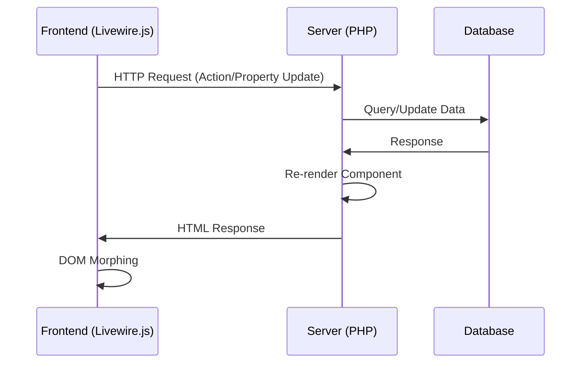

# 🔥 Livewire Architecture Study

## 📋 Overview

Laravel Livewire é um framework full-stack que permite criar UIs dinâmicas sem escrever JavaScript. A arquitetura do Livewire será nossa base para criar **Live Components** no FluxStack.

## 🏗️ Core Architecture

### 1. **Component Structure**

```php
class CreatePost extends Component
{
    public $title = '';
    public $content = '';
    
    public function save()
    {
        Post::create([
            'title' => $this->title,
            'content' => $this->content,
        ]);
        
        return redirect('/posts');
    }
    
    public function render()
    {
        return view('livewire.create-post');
    }
}
```

**Características principais:**
- **Properties**: Variáveis públicas mantêm estado
- **Actions**: Métodos executam lógica de negócio
- **Render**: Retorna view do componente

### 2. **Request-Response Cycle**



**Fluxo detalhado:**
1. **User Interaction** → Livewire.js captura evento
2. **HTTP Request** → Dados enviados para servidor
3. **Server Processing** → Laravel processa request
4. **Re-render** → Componente é re-renderizado
5. **DOM Morphing** → Frontend atualiza apenas as diferenças

### 3. **Data Binding**

```html
<!-- two-way data binding -->
<input wire:model="title" type="text">

<!-- live binding (real-time) -->
<input wire:model.live="search" type="text">

<!-- actions -->
<button wire:click="save">Save Post</button>
```

**Tipos de binding:**
- **wire:model** → Sincroniza no submit/action
- **wire:model.live** → Sincroniza em tempo real (150ms debounce)
- **wire:click** → Executa ações no servidor

## 🚀 Livewire 4 Islands (2024/2025)

### **Islands Architecture**

```html
<div>
    <!-- Conteúdo estático -->
    <h1>My Blog</h1>
    
    <!-- Island - renderiza independentemente -->
    <x-island>
        <livewire:post-list />
    </x-island>
    
    <!-- Outro conteúdo estático -->
    <footer>Copyright 2024</footer>
</div>
```

**Benefícios:**
- **3x faster** initial load
- **10x faster** component updates
- **Selective rendering** - apenas islands atualizam
- **Better UX** - mantém scroll position e focus

### **Performance Improvements**

1. **Lazy Loading**: Components carregam sob demanda
2. **Selective Updates**: Apenas partes alteradas re-renderizam
3. **Smart Morphing**: DOM diffing inteligente
4. **Turbo Integration**: Navegação sem full page reload

## 🔄 Component Communication

### **Events System**

```php
// Emitir evento
$this->dispatch('post-created', $post->id);

// Escutar evento
#[On('post-created')] 
public function handlePostCreated($postId)
{
    $this->loadPosts();
}
```

```html
<!-- Frontend event listening -->
<div wire:on="post-created">Post created!</div>
```

### **Parent-Child Communication**

```php
// Parent para Child
<livewire:child-component :data="$parentData" />

// Child para Parent
$this->dispatch('child-updated')->to(parent::class);
```

## 🎯 Key Features para Tempo Real

### 1. **Real-time Validation**
```html
<input wire:model.live="email" type="email">
@error('email') <span>{{ $message }}</span> @enderror
```

### 2. **Live Search**
```php
public $search = '';

public function updatedSearch()
{
    // Executa a cada keystroke (com debounce)
}
```

### 3. **File Upload**
```html
<input wire:model="photo" type="file">
<div wire:loading wire:target="photo">Uploading...</div>
```

## 🔧 JavaScript Integration

### **$wire Object**
```javascript
// Acessar properties
console.log($wire.title);

// Chamar methods
$wire.save();

// Escutar eventos
$wire.on('post-saved', () => {
    alert('Post saved!');
});
```

### **Custom Scripts**
```html
@script
<script>
    $wire.on('post-created', (event) => {
        // Custom JavaScript logic
        showNotification('Post created successfully!');
    });
</script>
@endscript
```

## 📊 Pros & Cons para FluxStack

### ✅ **Vantagens**
- **Simplicidade**: Menos JavaScript complexo
- **Produtividade**: Desenvolvimento mais rápido  
- **State Management**: Estado gerenciado no servidor
- **SEO Friendly**: Server-side rendering
- **Real-time**: Updates automáticos

### ⚠️ **Limitações**
- **Latência**: Dependente de requests HTTP
- **Offline**: Não funciona sem conexão
- **Complex UX**: Animações/transitions limitadas
- **Bandwidth**: Mais dados transferidos

## 🎯 Adaptações para FluxStack

### **Melhorias com TypeScript + WebSockets**
1. **Type Safety**: Inferência automática de tipos
2. **Real-time**: WebSockets eliminam latência HTTP
3. **Offline Support**: Service Workers + state sync
4. **Better UX**: Animações nativas com React
5. **Eden Treaty**: Type-safe communication

### **Arquitetura Híbrida**
- **HTTP**: Para actions pontuais (CRUD)
- **WebSocket**: Para real-time updates
- **SSR**: Para SEO e first paint
- **Client State**: Para UX complexa

---

**Next Steps**: Estudar WebSockets e desenhar arquitetura FluxStack Live Components