# 🔌 WebSocket Integration Study

## 📋 Overview

Diferente do Livewire que usa HTTP requests, vamos usar **WebSockets** para comunicação real-time entre frontend e backend, eliminando latência e permitindo comunicação bidirecional instantânea.

## 🏗️ WebSocket vs HTTP Architecture

### **HTTP (Livewire)**


### **WebSocket (FluxStack Live)**

```mermaid
sequenceDiagram
    participant C as Client
    participant S as Server
    
    C->>S: WebSocket Connect
    S->>C: Connection Established
    
    loop Real-time Communication
        C->>S: Component Action
        S->>S: Process Action
        S->>C: State Update
        C->>C: Re-render Component
    end
    
    Note over C,S: Conexão persistente
```


## 🚀 Elysia + WebSocket Integration

### **Server Setup (Elysia)**

```typescript
// core/server/websocket.ts
import { Elysia } from 'elysia'
import { WebSocketMessage, LiveComponentState } from './types'

export const websocketPlugin = new Elysia({ name: 'websocket' })
  .ws('/live', {
    // Quando cliente conecta
    open(ws) {
      console.log('🔌 Client connected:', ws.id)
      ws.data.components = new Map<string, LiveComponentState>()
    },

    // Mensagem recebida do cliente  
    message(ws, message: WebSocketMessage) {
      const { type, componentId, action, payload } = message

      switch (type) {
        case 'COMPONENT_MOUNT':
          return this.mountComponent(ws, componentId, payload)
        
        case 'COMPONENT_ACTION':
          return this.executeAction(ws, componentId, action, payload)
          
        case 'PROPERTY_UPDATE':
          return this.updateProperty(ws, componentId, payload.property, payload.value)
      }
    },

    // Cliente desconecta
    close(ws) {
      console.log('❌ Client disconnected:', ws.id)
    }
  })
```

### **Component System**

```typescript
// core/live/Component.ts
export abstract class LiveComponent<T = {}> {
  public id: string
  public state: T
  public ws: WebSocket
  
  constructor(initialState: T, ws: WebSocket) {
    this.id = generateId()
    this.state = initialState
    this.ws = ws
  }
  
  // Atualizar propriedade
  protected setState(updates: Partial<T>) {
    this.state = { ...this.state, ...updates }
    this.emit('STATE_UPDATE', { 
      componentId: this.id, 
      state: this.state 
    })
  }
  
  // Executar ação
  protected async executeAction(action: string, payload: any) {
    try {
      // @ts-ignore - dynamic method call
      const result = await this[action](payload)
      return result
    } catch (error) {
      this.emit('ERROR', { action, error: error.message })
    }
  }
  
  // Emitir evento para frontend
  protected emit(type: string, payload: any) {
    this.ws.send(JSON.stringify({
      type,
      componentId: this.id,
      payload
    }))
  }
  
  // Método abstrato que deve ser implementado
  abstract render(): React.ComponentType
}
```

## 📱 Frontend Integration (React)

### **WebSocket Hook**

```typescript
// app/client/src/hooks/useWebSocket.ts
export function useWebSocket(url: string) {
  const [ws, setWs] = useState<WebSocket | null>(null)
  const [connected, setConnected] = useState(false)
  
  useEffect(() => {
    const websocket = new WebSocket(url)
    
    websocket.onopen = () => {
      setConnected(true)
      setWs(websocket)
    }
    
    websocket.onclose = () => {
      setConnected(false)
      setWs(null)
    }
    
    websocket.onerror = (error) => {
      console.error('WebSocket error:', error)
    }
    
    return () => websocket.close()
  }, [url])
  
  const sendMessage = useCallback((message: any) => {
    if (ws && connected) {
      ws.send(JSON.stringify(message))
    }
  }, [ws, connected])
  
  return { ws, connected, sendMessage }
}
```

### **Live Component Hook**

```typescript
// app/client/src/hooks/useLiveComponent.ts
export function useLiveComponent<T>(
  componentName: string, 
  initialProps: T
) {
  const { sendMessage } = useWebSocket('/live')
  const [state, setState] = useState<T>(initialProps)
  const [loading, setLoading] = useState(false)
  const componentId = useRef(generateId())
  
  // Mount component no servidor
  useEffect(() => {
    sendMessage({
      type: 'COMPONENT_MOUNT',
      componentId: componentId.current,
      payload: { 
        component: componentName, 
        props: initialProps 
      }
    })
  }, [])
  
  // Executar ação no servidor
  const call = useCallback(async (action: string, payload?: any) => {
    setLoading(true)
    sendMessage({
      type: 'COMPONENT_ACTION',
      componentId: componentId.current,
      action,
      payload
    })
  }, [sendMessage])
  
  // Atualizar propriedade
  const set = useCallback((property: keyof T, value: any) => {
    setState(prev => ({ ...prev, [property]: value }))
    sendMessage({
      type: 'PROPERTY_UPDATE',
      componentId: componentId.current,
      payload: { property, value }
    })
  }, [sendMessage])
  
  return { state, call, set, loading }
}
```

## 🎯 Example: Live Counter Component

### **Backend Component**

```typescript
// app/server/live/CounterComponent.ts
export class CounterComponent extends LiveComponent<{
  count: number
  title: string
}> {
  
  async increment(amount: number = 1) {
    this.setState({ 
      count: this.state.count + amount 
    })
    
    // Log da ação
    console.log(`Counter incremented to: ${this.state.count}`)
  }
  
  async decrement(amount: number = 1) {
    this.setState({ 
      count: Math.max(0, this.state.count - amount)
    })
  }
  
  async reset() {
    this.setState({ count: 0 })
  }
  
  render() {
    return () => (
      <div className="counter">
        <h2>{this.state.title}</h2>
        <div className="count">{this.state.count}</div>
        <div className="actions">
          <button onClick={() => this.call('decrement')}>-</button>
          <button onClick={() => this.call('increment')}>+</button>
          <button onClick={() => this.call('reset')}>Reset</button>
        </div>
      </div>
    )
  }
}
```

### **Frontend Usage**

```typescript
// app/client/src/components/LiveCounter.tsx
export function LiveCounter() {
  const { state, call } = useLiveComponent('CounterComponent', {
    count: 0,
    title: 'Live Counter'
  })
  
  return (
    <div className="counter">
      <h2>{state.title}</h2>
      <div className="count">{state.count}</div>
      <div className="actions">
        <button onClick={() => call('decrement')}>-</button>
        <button onClick={() => call('increment')}>+</button>
        <button onClick={() => call('reset')}>Reset</button>
      </div>
    </div>
  )
}
```

## 🔄 Real-time Features

### **Multi-client Sync**

```typescript
// app/server/live/ChatComponent.ts
export class ChatComponent extends LiveComponent<{
  messages: Message[]
  users: User[]
}> {
  
  async sendMessage(content: string, userId: string) {
    const message = {
      id: generateId(),
      content,
      userId,
      timestamp: Date.now()
    }
    
    this.setState({
      messages: [...this.state.messages, message]
    })
    
    // Broadcast para todos os clientes conectados
    this.broadcast('MESSAGE_RECEIVED', { message })
  }
  
  private broadcast(type: string, payload: any) {
    // Enviar para todos os WebSockets conectados
    this.broadcastToAll({
      type,
      componentId: this.id,
      payload
    })
  }
}
```

### **Live Data Binding**

```typescript
// Real-time form updates
export function LiveForm() {
  const { state, set, call } = useLiveComponent('FormComponent', {
    name: '',
    email: '',
    errors: {}
  })
  
  return (
    <form onSubmit={() => call('submit')}>
      <input
        value={state.name}
        onChange={(e) => set('name', e.target.value)}
        onBlur={() => call('validateField', 'name')}
      />
      {state.errors.name && (
        <span className="error">{state.errors.name}</span>
      )}
    </form>
  )
}
```

## 🔧 Advanced Features

### **Optimistic Updates**

```typescript
const { state, call } = useLiveComponent('TodoComponent', { todos: [] })

const addTodo = async (text: string) => {
  // Optimistic update - atualiza UI imediatamente
  const optimisticTodo = { id: 'temp', text, completed: false }
  setState(prev => ({
    ...prev,
    todos: [...prev.todos, optimisticTodo]
  }))
  
  try {
    // Executa no servidor
    await call('addTodo', { text })
  } catch (error) {
    // Reverte se falhar
    setState(prev => ({
      ...prev,
      todos: prev.todos.filter(t => t.id !== 'temp')
    }))
  }
}
```

### **Connection Management**

```typescript
// Auto-reconnect on connection loss
export function useReconnectingWebSocket(url: string) {
  const [reconnectAttempts, setReconnectAttempts] = useState(0)
  const maxReconnectAttempts = 5
  
  const connect = useCallback(() => {
    const ws = new WebSocket(url)
    
    ws.onclose = () => {
      if (reconnectAttempts < maxReconnectAttempts) {
        setTimeout(() => {
          setReconnectAttempts(prev => prev + 1)
          connect() // Retry connection
        }, 2000 * Math.pow(2, reconnectAttempts)) // Exponential backoff
      }
    }
    
    return ws
  }, [url, reconnectAttempts])
  
  return connect
}
```

## 📊 Benefits over HTTP-only

### ✅ **Vantagens**
- **Zero Latency**: Comunicação instantânea
- **Bidirectional**: Servidor pode iniciar updates
- **Connection Reuse**: Sem overhead de HTTP headers
- **Real-time**: Múltiplos usuários em sync
- **Better UX**: Sem loading states para micro-interactions

### ⚠️ **Considerations**
- **Connection Management**: Precisa gerenciar desconexões
- **Scaling**: WebSocket connections são stateful
- **Complexity**: Mais complexo que REST APIs
- **Debugging**: Mais difícil de debugar que HTTP

---

**Next**: Desenhar arquitetura completa FluxStack Live Components