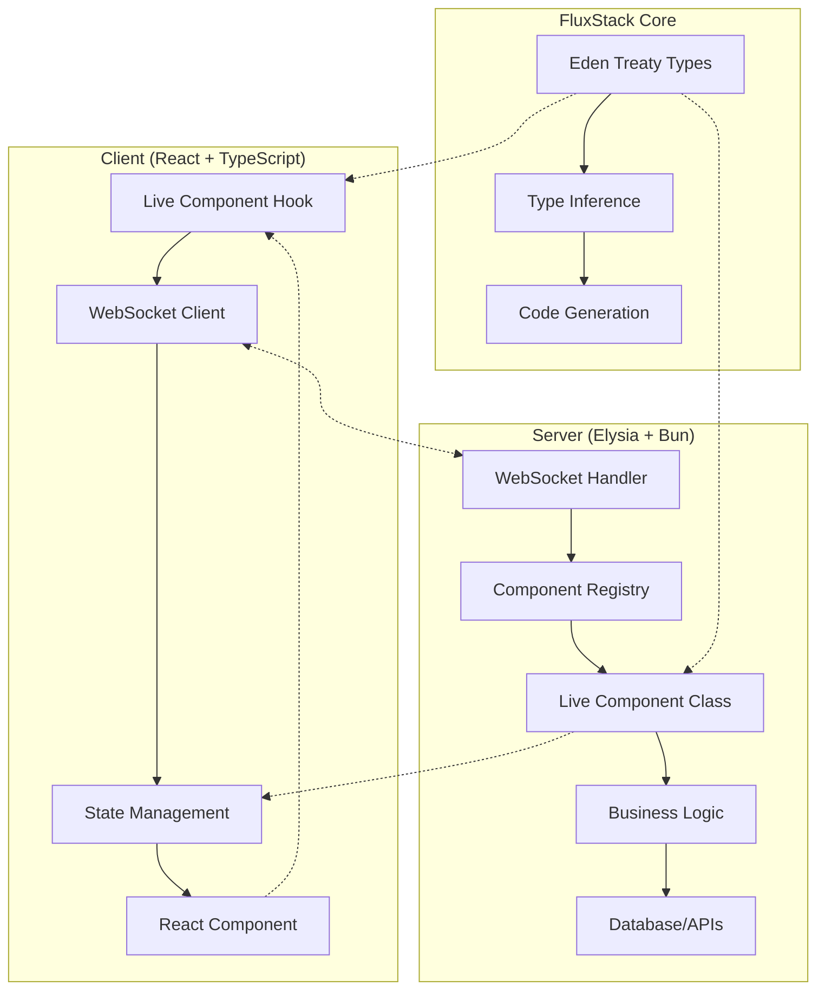

# 🚀 FluxStack Live Components - Architecture Design

## 📋 Overview

FluxStack Live Components combinam o melhor do Livewire com as vantagens do JavaScript moderno, WebSockets e TypeScript, criando uma solução superior para desenvolvimento full-stack.

## 🎯 Core Philosophy

### **"Write Once, Run Everywhere"**
```typescript
// Um componente, múltiplas possibilidades
class UserProfile extends LiveComponent {
  // 🎛️ Estado no servidor (source of truth)
  // 🔄 Sincronização automática via WebSocket  
  // 🎨 Renderização no client (React)
  // 🔒 Type safety completa (TypeScript)
}
```

### **Key Principles**
1. **Server-First**: Estado e lógica de negócio no servidor
2. **Type-Safe**: Inferência automática end-to-end
3. **Real-time**: WebSockets por padrão
4. **Developer Experience**: Hot reload, debugging, IntelliSense
5. **Performance**: Otimizações automáticas

## 🏗️ Architecture Overview



## 🔧 Core Components

### **1. LiveComponent Base Class**

```typescript
// core/live/LiveComponent.ts
export abstract class LiveComponent<TState = {}, TProps = {}> {
  public readonly id: string
  protected state: TState
  protected props: TProps
  protected ws: WebSocket
  protected subscribers: Set<string> = new Set()
  
  constructor(props: TProps, ws: WebSocket) {
    this.id = generateUUID()
    this.props = props
    this.ws = ws
    this.state = this.initialState()
    
    // Registrar componente
    LiveComponentRegistry.register(this.id, this)
  }
  
  // Estado inicial - deve ser implementado
  protected abstract initialState(): TState
  
  // Atualizar estado e notificar clientes
  protected setState(updates: Partial<TState> | ((prev: TState) => TState)) {
    const newState = typeof updates === 'function' 
      ? updates(this.state)
      : { ...this.state, ...updates }
      
    this.state = newState
    this.notifyStateChange()
  }
  
  // Executar ação (com validação de tipos)
  async executeAction<T extends keyof this>(
    action: T, 
    payload?: any
  ): Promise<any> {
    try {
      if (typeof this[action] !== 'function') {
        throw new Error(`Action '${String(action)}' not found`)
      }
      
      // @ts-ignore - dynamic method invocation
      const result = await this[action](payload)
      return result
      
    } catch (error) {
      this.emitError(String(action), error)
      throw error
    }
  }
  
  // Emitir evento para cliente(s)
  protected emit(event: string, payload: any) {
    this.ws.send(JSON.stringify({
      type: 'COMPONENT_EVENT',
      componentId: this.id,
      event,
      payload
    }))
  }
  
  // Broadcast para múltiplos clientes
  protected broadcast(event: string, payload: any) {
    LiveComponentRegistry.broadcast(this.id, {
      type: 'COMPONENT_EVENT',
      componentId: this.id,
      event,
      payload
    })
  }
  
  // Notificar mudança de estado
  private notifyStateChange() {
    this.emit('STATE_UPDATE', {
      state: this.state,
      timestamp: Date.now()
    })
  }
  
  // Lifecycle hooks
  onMount?(): void | Promise<void>
  onUnmount?(): void | Promise<void>
  
  // Cleanup
  destroy() {
    this.onUnmount?.()
    LiveComponentRegistry.unregister(this.id)
  }
}
```

### **2. Component Registry**

```typescript
// core/live/ComponentRegistry.ts
export class LiveComponentRegistry {
  private static components = new Map<string, LiveComponent>()
  private static wsConnections = new Map<string, Set<WebSocket>>()
  
  static register(id: string, component: LiveComponent) {
    this.components.set(id, component)
  }
  
  static get(id: string): LiveComponent | undefined {
    return this.components.get(id)
  }
  
  static unregister(id: string) {
    const component = this.components.get(id)
    if (component) {
      component.destroy()
      this.components.delete(id)
    }
  }
  
  static addConnection(componentId: string, ws: WebSocket) {
    if (!this.wsConnections.has(componentId)) {
      this.wsConnections.set(componentId, new Set())
    }
    this.wsConnections.get(componentId)!.add(ws)
  }
  
  static broadcast(componentId: string, message: any) {
    const connections = this.wsConnections.get(componentId)
    if (connections) {
      connections.forEach(ws => {
        if (ws.readyState === ws.OPEN) {
          ws.send(JSON.stringify(message))
        }
      })
    }
  }
  
  static getStats() {
    return {
      totalComponents: this.components.size,
      totalConnections: Array.from(this.wsConnections.values())
        .reduce((total, set) => total + set.size, 0)
    }
  }
}
```

### **3. WebSocket Plugin**

```typescript
// core/live/websocket-plugin.ts
import { Elysia } from 'elysia'
import { LiveComponentRegistry } from './ComponentRegistry'
import { createComponent } from './component-factory'

export const liveComponentsPlugin = new Elysia({ name: 'live-components' })
  .ws('/live', {
    open(ws) {
      ws.data.componentIds = new Set<string>()
      console.log(`🔌 Client connected: ${ws.id}`)
    },
    
    async message(ws, message: LiveMessage) {
      try {
        await handleLiveMessage(ws, message)
      } catch (error) {
        ws.send(JSON.stringify({
          type: 'ERROR',
          error: error.message,
          timestamp: Date.now()
        }))
      }
    },
    
    close(ws) {
      // Cleanup components deste cliente
      ws.data.componentIds?.forEach((id: string) => {
        LiveComponentRegistry.unregister(id)
      })
      console.log(`❌ Client disconnected: ${ws.id}`)
    }
  })

async function handleLiveMessage(ws: WebSocket, message: LiveMessage) {
  const { type, componentId, payload } = message
  
  switch (type) {
    case 'COMPONENT_MOUNT':
      return await mountComponent(ws, payload)
      
    case 'COMPONENT_ACTION':
      return await executeAction(ws, componentId, payload)
      
    case 'PROPERTY_UPDATE':
      return await updateProperty(ws, componentId, payload)
      
    case 'COMPONENT_UNMOUNT':
      return unmountComponent(ws, componentId)
  }
}

async function mountComponent(ws: WebSocket, payload: MountPayload) {
  const { componentName, props } = payload
  
  // Criar instância do componente
  const component = await createComponent(componentName, props, ws)
  
  // Registrar conexão
  LiveComponentRegistry.addConnection(component.id, ws)
  ws.data.componentIds.add(component.id)
  
  // Lifecycle
  await component.onMount?.()
  
  // Responder com estado inicial
  ws.send(JSON.stringify({
    type: 'COMPONENT_MOUNTED',
    componentId: component.id,
    state: component.state,
    timestamp: Date.now()
  }))
  
  return component
}
```

## 📱 Frontend Integration

### **1. useLiveComponent Hook**

```typescript
// app/client/src/hooks/useLiveComponent.ts
export function useLiveComponent<
  TState extends Record<string, any>,
  TActions extends Record<string, (...args: any[]) => any>
>(
  componentName: string,
  initialProps?: any
): LiveComponentInstance<TState, TActions> {
  
  const { ws, connected, sendMessage } = useWebSocket('/live')
  const [state, setState] = useState<TState>({} as TState)
  const [loading, setLoading] = useState(false)
  const [errors, setErrors] = useState<Record<string, string>>({})
  const componentId = useRef<string>()
  
  // Mount component
  useEffect(() => {
    if (connected && !componentId.current) {
      const mountMessage = {
        type: 'COMPONENT_MOUNT',
        payload: {
          componentName,
          props: initialProps
        }
      }
      
      sendMessage(mountMessage)
    }
  }, [connected, componentName, initialProps])
  
  // Listen for messages
  useEffect(() => {
    if (!ws) return
    
    const handleMessage = (event: MessageEvent) => {
      const message = JSON.parse(event.data)
      
      if (message.componentId !== componentId.current) return
      
      switch (message.type) {
        case 'COMPONENT_MOUNTED':
          componentId.current = message.componentId
          setState(message.state)
          break
          
        case 'STATE_UPDATE':
          setState(message.payload.state)
          break
          
        case 'COMPONENT_EVENT':
          // Handle custom events
          break
          
        case 'ERROR':
          setErrors(prev => ({
            ...prev,
            [message.action || 'general']: message.error
          }))
          break
      }
    }
    
    ws.addEventListener('message', handleMessage)
    return () => ws.removeEventListener('message', handleMessage)
  }, [ws])
  
  // Execute action
  const call = useCallback(async <T extends keyof TActions>(
    action: T,
    payload?: Parameters<TActions[T]>[0]
  ): Promise<ReturnType<TActions[T]>> => {
    if (!componentId.current || !connected) {
      throw new Error('Component not connected')
    }
    
    setLoading(true)
    setErrors(prev => ({ ...prev, [action as string]: '' }))
    
    try {
      sendMessage({
        type: 'COMPONENT_ACTION',
        componentId: componentId.current,
        payload: { action, data: payload }
      })
    } finally {
      setLoading(false)
    }
  }, [connected, sendMessage])
  
  // Update property
  const set = useCallback(<K extends keyof TState>(
    property: K,
    value: TState[K]
  ) => {
    if (!componentId.current) return
    
    // Optimistic update
    setState(prev => ({ ...prev, [property]: value }))
    
    sendMessage({
      type: 'PROPERTY_UPDATE',
      componentId: componentId.current,
      payload: { property, value }
    })
  }, [sendMessage])
  
  // Cleanup
  useEffect(() => {
    return () => {
      if (componentId.current) {
        sendMessage({
          type: 'COMPONENT_UNMOUNT',
          componentId: componentId.current
        })
      }
    }
  }, [])
  
  return {
    state,
    call,
    set,
    loading,
    errors,
    connected,
    id: componentId.current
  }
}
```

### **2. Component Factory with Type Generation**

```typescript
// core/live/component-factory.ts
import { generateTypeDefinitions } from './type-generator'

const componentRegistry = new Map<string, any>()

export function registerComponent<T extends LiveComponent>(
  name: string,
  componentClass: new (...args: any[]) => T
) {
  componentRegistry.set(name, componentClass)
  
  // Generate TypeScript definitions
  generateTypeDefinitions(name, componentClass)
}

export async function createComponent(
  name: string,
  props: any,
  ws: WebSocket
): Promise<LiveComponent> {
  const ComponentClass = componentRegistry.get(name)
  
  if (!ComponentClass) {
    throw new Error(`Component '${name}' not found`)
  }
  
  return new ComponentClass(props, ws)
}

// Auto-register components
export function autoRegisterComponents() {
  // Scan app/server/live/ directory
  // Auto-register all components
  const components = import.meta.glob('../../../app/server/live/*.ts')
  
  Object.entries(components).forEach(([path, loader]) => {
    const name = path.match(/\/(\w+)\.ts$/)?.[1]
    if (name) {
      loader().then(module => {
        const componentClass = module[name + 'Component'] || module.default
        if (componentClass) {
          registerComponent(name, componentClass)
        }
      })
    }
  })
}
```

## 🎯 Example Implementation

### **Backend Component**

```typescript
// app/server/live/TodoListComponent.ts
interface TodoListState {
  todos: Todo[]
  filter: 'all' | 'active' | 'completed'
  newTodoText: string
}

interface TodoListProps {
  userId: string
  listId: string
}

export class TodoListComponent extends LiveComponent<TodoListState, TodoListProps> {
  
  protected initialState(): TodoListState {
    return {
      todos: [],
      filter: 'all',
      newTodoText: ''
    }
  }
  
  async onMount() {
    // Load todos from database
    const todos = await Todo.findBy('listId', this.props.listId)
    this.setState({ todos })
  }
  
  async addTodo(text: string) {
    const todo = await Todo.create({
      text,
      completed: false,
      listId: this.props.listId,
      userId: this.props.userId
    })
    
    this.setState(prev => ({
      todos: [...prev.todos, todo],
      newTodoText: ''
    }))
    
    // Broadcast para outros usuários
    this.broadcast('TODO_ADDED', { todo })
  }
  
  async toggleTodo(todoId: string) {
    const todo = await Todo.find(todoId)
    todo.completed = !todo.completed
    await todo.save()
    
    this.setState(prev => ({
      todos: prev.todos.map(t => 
        t.id === todoId ? { ...t, completed: todo.completed } : t
      )
    }))
    
    this.broadcast('TODO_UPDATED', { todo })
  }
  
  async deleteTodo(todoId: string) {
    await Todo.delete(todoId)
    
    this.setState(prev => ({
      todos: prev.todos.filter(t => t.id !== todoId)
    }))
    
    this.broadcast('TODO_DELETED', { todoId })
  }
  
  setFilter(filter: 'all' | 'active' | 'completed') {
    this.setState({ filter })
  }
  
  get filteredTodos() {
    const { todos, filter } = this.state
    
    switch (filter) {
      case 'active': return todos.filter(t => !t.completed)
      case 'completed': return todos.filter(t => t.completed)
      default: return todos
    }
  }
}
```

### **Frontend Usage**

```typescript
// app/client/src/components/TodoList.tsx
export function TodoList({ userId, listId }: { userId: string, listId: string }) {
  const { state, call, set, loading } = useLiveComponent('TodoList', {
    userId,
    listId
  })
  
  const handleSubmit = (e: React.FormEvent) => {
    e.preventDefault()
    if (state.newTodoText.trim()) {
      call('addTodo', state.newTodoText)
    }
  }
  
  return (
    <div className="todo-list">
      <form onSubmit={handleSubmit}>
        <input
          value={state.newTodoText}
          onChange={e => set('newTodoText', e.target.value)}
          placeholder="Add new todo..."
          disabled={loading}
        />
        <button type="submit" disabled={loading}>
          Add Todo
        </button>
      </form>
      
      <div className="filters">
        {(['all', 'active', 'completed'] as const).map(filter => (
          <button
            key={filter}
            className={state.filter === filter ? 'active' : ''}
            onClick={() => call('setFilter', filter)}
          >
            {filter}
          </button>
        ))}
      </div>
      
      <ul className="todos">
        {state.todos
          .filter(todo => {
            if (state.filter === 'active') return !todo.completed
            if (state.filter === 'completed') return todo.completed
            return true
          })
          .map(todo => (
            <li key={todo.id} className={todo.completed ? 'completed' : ''}>
              <input
                type="checkbox"
                checked={todo.completed}
                onChange={() => call('toggleTodo', todo.id)}
              />
              <span>{todo.text}</span>
              <button onClick={() => call('deleteTodo', todo.id)}>
                Delete
              </button>
            </li>
          ))
        }
      </ul>
    </div>
  )
}
```

## 🚀 Advanced Features

### **1. Type Generation & IntelliSense**

```typescript
// Generated types (automatic)
export interface TodoListComponentClient {
  state: {
    todos: Todo[]
    filter: 'all' | 'active' | 'completed'
    newTodoText: string
  }
  actions: {
    addTodo: (text: string) => Promise<void>
    toggleTodo: (todoId: string) => Promise<void>
    deleteTodo: (todoId: string) => Promise<void>
    setFilter: (filter: 'all' | 'active' | 'completed') => void
  }
}
```

### **2. Multi-user Synchronization**

```typescript
// Automatic sync between multiple users
const { state } = useLiveComponent('TodoList', { listId: 'shared-list' })

// User A adds todo → User B sees it instantly
// User B completes todo → User A sees update immediately
```

### **3. Optimistic Updates**

```typescript
// Built-in optimistic updates
const { call } = useLiveComponent('TodoList', {})

// UI updates immediately, reverts if server rejects
await call('addTodo', 'New todo', { optimistic: true })
```

### **4. Offline Support**

```typescript
// Queue actions when offline
const { call, online } = useLiveComponent('TodoList', {})

if (!online) {
  // Actions are queued and sent when reconnected
  await call('addTodo', 'Offline todo')
}
```

## 📊 Benefits & Trade-offs

### ✅ **Advantages over Livewire**
- **No HTTP Overhead**: WebSocket connection
- **Real-time by Default**: Instant updates
- **Type Safety**: Full TypeScript integration
- **Better UX**: No loading states for micro-interactions
- **Modern Stack**: React, Bun, TypeScript
- **Multi-user**: Built-in real-time collaboration

### ✅ **Advantages over Traditional SPAs**
- **Less Complexity**: No complex state management
- **Server-First**: Business logic stays secure
- **Real-time**: Built-in WebSocket support  
- **Type Safety**: Automatic type inference
- **Developer Experience**: Hot reload, debugging

### ⚠️ **Considerations**
- **Learning Curve**: New paradigm
- **WebSocket Scaling**: Needs proper infrastructure
- **Connection Management**: Handle disconnections
- **Bundle Size**: Additional client-side code

---

**Next**: Start implementing the core infrastructure