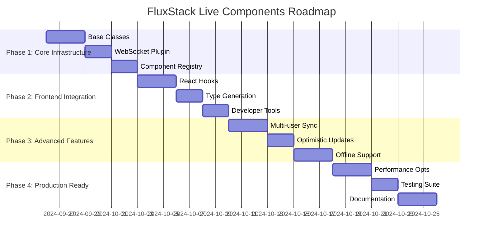

# 🗺️ FluxStack Live Components - Implementation Roadmap

## 📋 Overview

Roadmap detalhado para implementar FluxStack Live Components no framework atual, com fases incrementais e marcos bem definidos.

## 🎯 Phases Overview



## 🚀 Phase 1: Core Infrastructure (Week 1)

### **Day 1-3: Base Classes & Types**

#### **1.1 Core Types**
```typescript
// core/live/types.ts
export interface LiveMessage {
  type: 'COMPONENT_MOUNT' | 'COMPONENT_ACTION' | 'PROPERTY_UPDATE' | 'COMPONENT_UNMOUNT'
  componentId?: string
  payload?: any
  timestamp?: number
}

export interface ComponentState {
  [key: string]: any
}

export interface LiveComponentInstance<TState, TActions> {
  state: TState
  call: <T extends keyof TActions>(action: T, ...args: any[]) => Promise<any>
  set: <K extends keyof TState>(property: K, value: TState[K]) => void
  loading: boolean
  errors: Record<string, string>
  connected: boolean
  id?: string
}
```

#### **1.2 LiveComponent Base Class**
```bash
# Create core structure
mkdir -p core/live
touch core/live/LiveComponent.ts
touch core/live/ComponentRegistry.ts
touch core/live/types.ts
touch core/live/websocket-plugin.ts
```

#### **1.3 WebSocket Infrastructure**
- Integrate with existing Elysia server
- Add WebSocket handling
- Connection management
- Message routing

### **Day 4-5: WebSocket Plugin Integration**

#### **1.4 Elysia Plugin**
```typescript
// Integration with existing core/server/index.ts
import { liveComponentsPlugin } from '../live/websocket-plugin'

export const server = new Elysia()
  .use(liveComponentsPlugin) // Add live components
  .use(swaggerPlugin)
  // ... existing plugins
```

#### **1.5 Message Handler System**
- Route messages to correct components
- Error handling and validation
- Connection state management

### **Day 6-7: Component Registry**

#### **1.6 Registry Implementation**
- Component lifecycle management
- Multi-client synchronization
- Memory management
- Statistics and debugging

**Deliverables Phase 1:**
- ✅ Base LiveComponent class
- ✅ WebSocket plugin integrated
- ✅ Component registry working
- ✅ Basic message routing
- ✅ Connection management

## 📱 Phase 2: Frontend Integration (Week 2)

### **Day 8-10: React Hooks**

#### **2.1 useLiveComponent Hook**
```typescript
// app/client/src/hooks/useLiveComponent.ts
// Complete implementation with:
// - Component mounting/unmounting
// - State synchronization
// - Action execution
// - Error handling
```

#### **2.2 useWebSocket Hook**
```typescript
// app/client/src/hooks/useWebSocket.ts
// WebSocket connection management:
// - Auto-reconnection
// - Connection status
// - Message queuing
// - Error recovery
```

#### **2.3 WebSocket Client**
```typescript
// app/client/src/lib/websocket-client.ts
// Centralized WebSocket client:
// - Connection pooling
// - Message serialization
// - Event system
// - Debug logging
```

### **Day 11-12: Type Generation**

#### **2.4 Automatic Type Generation**
```typescript
// core/live/type-generator.ts
// Generate TypeScript definitions for:
// - Component state interfaces
// - Action method signatures
// - Event payloads
// - Hook return types
```

#### **2.5 Eden Treaty Integration**
```typescript
// Integrate with existing Eden Treaty system
// Type inference from server components
// Automatic client-side types
```

### **Day 13-14: Developer Tools**

#### **2.6 Development Experience**
- Hot reload for live components
- Debug panel in browser
- Component state inspector
- WebSocket message logger

#### **2.7 CLI Integration**
```bash
# Extend existing CLI
bun flux make:live-component TodoList
bun flux live:stats
bun flux live:debug
```

**Deliverables Phase 2:**
- ✅ React hooks complete
- ✅ Type generation working
- ✅ Developer tools available
- ✅ Hot reload support
- ✅ CLI integration

## 🔥 Phase 3: Advanced Features (Week 3)

### **Day 15-17: Multi-user Synchronization**

#### **3.1 Room-based Components**
```typescript
// Components can join "rooms" for multi-user sync
class ChatComponent extends LiveComponent {
  async joinRoom(roomId: string) {
    await this.subscribeToRoom(roomId)
    this.broadcast('USER_JOINED', { userId: this.props.userId })
  }
}
```

#### **3.2 Conflict Resolution**
```typescript
// Handle simultaneous updates
// Last-writer-wins vs operational transforms
// Conflict detection and resolution
```

#### **3.3 User Presence**
```typescript
// Track online users
// Show who's currently viewing/editing
// Typing indicators
```

### **Day 18-19: Optimistic Updates**

#### **3.4 Optimistic State Management**
```typescript
// Immediate UI updates with server rollback
const { call } = useLiveComponent('TodoList', {})

// Updates UI immediately, rollback if fails
await call('addTodo', text, { optimistic: true })
```

#### **3.5 Smart Rollback**
```typescript
// Intelligent rollback strategies
// Preserve user input during rollback
// Visual feedback for failed operations
```

### **Day 20-22: Offline Support**

#### **3.6 Action Queuing**
```typescript
// Queue actions when offline
// Replay when reconnected
// Conflict resolution for offline actions
```

#### **3.7 Local State Persistence**
```typescript
// Persist component state locally
// Hydrate on reconnection
// Sync with server state
```

#### **3.8 Progressive Enhancement**
```typescript
// Graceful degradation when WebSockets fail
// Fallback to HTTP requests
// Seamless transitions
```

**Deliverables Phase 3:**
- ✅ Multi-user synchronization
- ✅ Optimistic updates
- ✅ Offline support
- ✅ Conflict resolution
- ✅ User presence tracking

## 🏁 Phase 4: Production Ready (Week 4)

### **Day 23-25: Performance Optimizations**

#### **4.1 Connection Scaling**
```typescript
// Connection pooling
// Load balancing for WebSockets
// Horizontal scaling strategies
```

#### **4.2 Message Optimization**
```typescript
// Binary protocol for performance
// Message compression
// Batching and debouncing
// Delta updates only
```

#### **4.3 Memory Management**
```typescript
// Garbage collection for components
// Weak references
// Memory leak prevention
// Performance monitoring
```

### **Day 26-27: Testing Suite**

#### **4.4 Unit Tests**
```typescript
// Test live components in isolation
// Mock WebSocket connections
// State transition testing
```

#### **4.5 Integration Tests**
```typescript
// End-to-end component testing
// Multi-client scenarios
// Network failure simulation
```

#### **4.6 Performance Tests**
```typescript
// Load testing WebSocket connections
// Memory usage monitoring
// Latency measurements
```

### **Day 28-30: Documentation & Examples**

#### **4.7 Complete Documentation**
```markdown
# API Reference
# Getting Started Guide
# Best Practices
# Troubleshooting Guide
# Migration Guide
```

#### **4.8 Example Applications**
```typescript
// Real-time chat application
// Collaborative todo list
// Live dashboard
// Multi-user drawing app
# Live form validation
```

#### **4.9 Deployment Guides**
```markdown
# Production deployment
# WebSocket infrastructure
# Scaling strategies
# Monitoring and debugging
```

**Deliverables Phase 4:**
- ✅ Production optimizations
- ✅ Complete testing suite
- ✅ Comprehensive documentation
- ✅ Example applications
- ✅ Deployment guides

## 📊 Success Metrics

### **Technical Metrics**
- **Latency**: < 50ms for local actions
- **Throughput**: 1000+ concurrent connections
- **Reliability**: 99.9% uptime
- **Memory**: < 1MB per component
- **Bundle Size**: < 50KB added to client

### **Developer Experience Metrics**
- **Setup Time**: < 5 minutes for new component
- **Learning Curve**: Productive within 1 hour
- **Debug Time**: Issues resolved in < 10 minutes
- **Type Safety**: 100% type coverage
- **Hot Reload**: < 1 second updates

### **User Experience Metrics**
- **Perceived Performance**: Instant interactions
- **Real-time Updates**: < 100ms propagation
- **Offline Grace**: Seamless reconnection
- **Multi-user**: Conflict-free collaboration
- **Stability**: No connection drops

## 🎯 Implementation Strategy

### **Week 1: Foundation**
- Focus on getting basic WebSocket communication working
- Simple state synchronization
- Basic component lifecycle

### **Week 2: Integration**  
- Polish React integration
- Type safety and developer experience
- Hot reload and debugging tools

### **Week 3: Advanced**
- Multi-user features
- Performance optimizations
- Edge case handling

### **Week 4: Polish**
- Production readiness
- Documentation
- Example applications

## 📝 Files to Create/Modify

### **New Files**
```
core/live/
├── LiveComponent.ts
├── ComponentRegistry.ts
├── websocket-plugin.ts
├── type-generator.ts
├── component-factory.ts
└── types.ts

app/client/src/hooks/
├── useLiveComponent.ts
├── useWebSocket.ts
└── useOptimistic.ts

app/client/src/lib/
├── websocket-client.ts
└── live-component-client.ts

app/server/live/
├── example-components/
└── README.md
```

### **Modified Files**
```
core/server/index.ts          # Add WebSocket plugin
core/cli/commands/            # Add live component commands
app/client/src/App.tsx        # Add live components demo
package.json                  # Add dependencies
vitest.config.ts             # Add live component tests
```

## 🔧 Dependencies to Add

### **Server Dependencies**
```json
{
  "dependencies": {
    "@elysiajs/websocket": "^1.0.0",
    "uuid": "^9.0.0"
  },
  "devDependencies": {
    "@types/uuid": "^9.0.0"
  }
}
```

### **Client Dependencies**
```json
{
  "dependencies": {
    "reconnecting-websocket": "^4.4.0"
  },
  "devDependencies": {
    "@types/ws": "^8.5.0"
  }
}
```

---

**Ready to start Phase 1!** 🚀

Primeira etapa: Implementar as classes base e infraestrutura WebSocket.